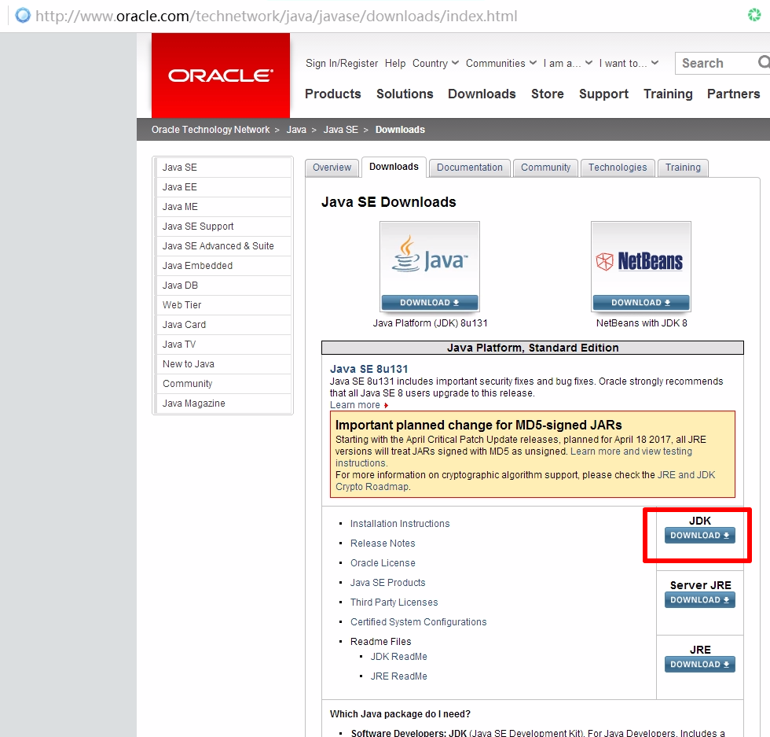
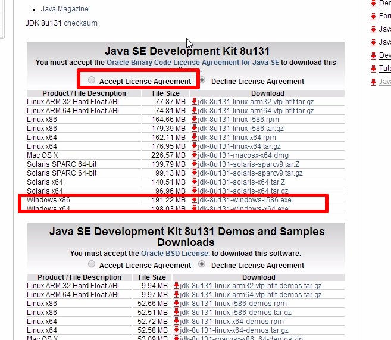
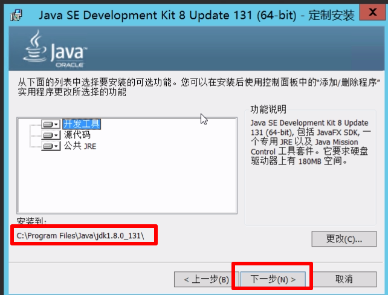
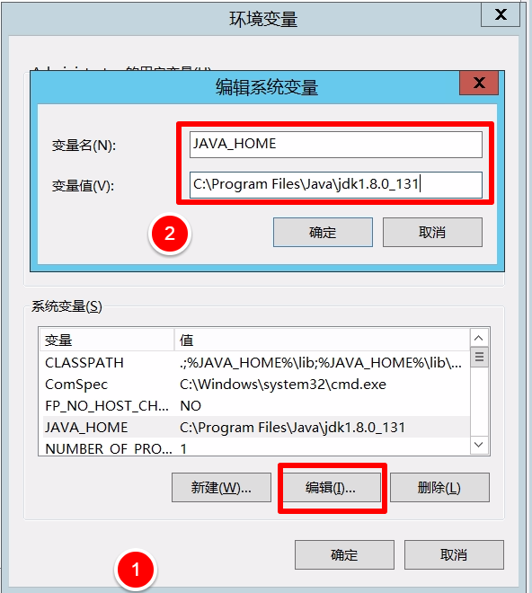
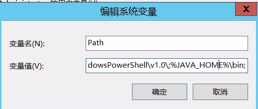
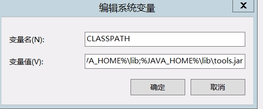
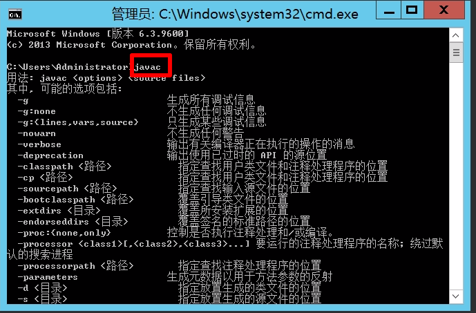
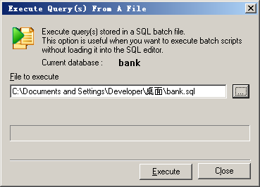

#Java部署
##一、Java环境配置

一、JDK下载

官网:http://www.oracle.com/technetwork/java/javase/downloads/

进入官网后下载界面如下:

  

点击JDK Download进入详细下载页如下:把Accepet License Agreement勾上,系统是32位的就选windowsx86.系统64为的两个都可选择，建议选windowsx61的。



下载之后，就是傻瓜式的安装了，一直下一步。

 


记住你下面的安装路径，后面配置环境变量会用到。

  

 

二、环境变量的配置：

为了方便java程序的开发，需要配置一下环境变量，右击我的电脑->属性->高级->环境变量->用户变量中单击[新建(N)]添加以下环境变量

 

1.配置JAVA_HOME

新建JAVA_HOME

变量名        JAVA_HOME

变量值        C:\Program Files\Java\jdk1.8.0_131   你的jdk安装地址


              

2.配置PATH                              

变量名  Path

变量值  %JAVA_HOME%\bin;

    

3.配置CLASSPATH                         

新建CALSSPATH


变量名        CLASSPATH

变量值        .;%JAVA_HOME%\lib\dt.jar;%JAVA_HOME%\lib\tools.jar;（注意的是最前面的".;"  因为WINDOWS默认的搜索顺序是先搜索当前目录的，再搜索系统目录的，再搜索PATH环境变量设定的 ）

   

 4.测试是否配置成功

window+R打开cmd窗口 输入javac出现如下说明配置成功

   

就这样java环境就搭建好了。


#mysql数据库部署
##二、导入数据库
我们系统所采用的数据库是MySQL数据库。在部署系统之前要先将我们的数据库导入到本地的MySQL数据库。
以可视化工具SQLyog为例，可以通过执行”Restore From SQL Dump…”菜单来导入我们的数据库，具体过程如下：

1)右击左边空白处，选中”Restore From SQL Dump…”


2)在出现的对话框中选择我们的数据库文件：


3)点击”Execute”后它会自动创建我们系统的数据库。


数据库代码如下：
```
/*
 Navicat MySQL Data Transfer
 Source Schema         : db_ktv
 Target Server Type    : MySQL
 Target Server Version : 50721
 File Encoding         : 65001
*/

SET NAMES utf8mb4;

SET FOREIGN_KEY_CHECKS = 0;

-- ----------------------------
-- Table structure for tb_food
-- ----------------------------
DROP TABLE IF EXISTS `tb_food`;
CREATE TABLE `tb_food`  (
  `id` int(11) NOT NULL AUTO_INCREMENT,
  `fname` varchar(20) CHARACTER SET utf8 COLLATE utf8_general_ci NOT NULL,
  `price` decimal(10, 2) NOT NULL,
  `stock` int(11) NOT NULL,
  PRIMARY KEY (`id`, `fname`) USING BTREE
) ENGINE = InnoDB AUTO_INCREMENT = 1 CHARACTER SET = utf8 COLLATE = utf8_general_ci ROW_FORMAT = Dynamic;

-- ----------------------------
-- Table structure for tb_manager
-- ----------------------------
DROP TABLE IF EXISTS `tb_manager`;
CREATE TABLE `tb_manager`  (
  `username` varchar(255) CHARACTER SET utf8 COLLATE utf8_general_ci NOT NULL,
  `password` varchar(255) CHARACTER SET utf8 COLLATE utf8_general_ci NOT NULL,
  PRIMARY KEY (`username`) USING BTREE
) ENGINE = InnoDB CHARACTER SET = utf8 COLLATE = utf8_general_ci ROW_FORMAT = Dynamic;

-- ----------------------------
-- Table structure for tb_order
-- ----------------------------
DROP TABLE IF EXISTS `tb_order`;
CREATE TABLE `tb_order`  (
  `id` int(11) NOT NULL AUTO_INCREMENT,
  `ordertime` datetime(0) DEFAULT NULL,
  `room` varchar(32) CHARACTER SET utf8 COLLATE utf8_general_ci NOT NULL,
  `cname` varchar(30) CHARACTER SET utf8 COLLATE utf8_general_ci NOT NULL,
  `phone` varchar(30) CHARACTER SET utf8 COLLATE utf8_general_ci NOT NULL,
  `price` int(11) DEFAULT NULL,
  `pay` int(11) DEFAULT 0,
  `detail` varchar(500) CHARACTER SET utf8 COLLATE utf8_general_ci DEFAULT NULL,
  PRIMARY KEY (`id`) USING BTREE,
  INDEX `fk_1`(`cname`) USING BTREE,
  INDEX `fk_2`(`phone`) USING BTREE,
  CONSTRAINT `fk_1` FOREIGN KEY (`cname`) REFERENCES `tb_vip` (`cname`) ON DELETE CASCADE ON UPDATE CASCADE,
  CONSTRAINT `fk_2` FOREIGN KEY (`phone`) REFERENCES `tb_vip` (`phone`) ON DELETE CASCADE ON UPDATE CASCADE
) ENGINE = InnoDB AUTO_INCREMENT = 1 CHARACTER SET = utf8 COLLATE = utf8_general_ci ROW_FORMAT = Dynamic;

-- ----------------------------
-- Table structure for tb_room
-- ----------------------------
DROP TABLE IF EXISTS `tb_room`;
CREATE TABLE `tb_room`  (
  `id` int(11) NOT NULL,
  `type` varchar(10) CHARACTER SET utf8 COLLATE utf8_general_ci NOT NULL,
  `price` double DEFAULT NULL,
  `status` int(11) NOT NULL DEFAULT 0,
  `start_time` datetime(0) DEFAULT NULL,
  `end_time` datetime(0) DEFAULT NULL,
  PRIMARY KEY (`type`, `id`) USING BTREE,
  INDEX `index`(`type`) USING BTREE
) ENGINE = InnoDB CHARACTER SET = utf8 COLLATE = utf8_general_ci ROW_FORMAT = Dynamic;

-- ----------------------------
-- Table structure for tb_vip
-- ----------------------------
DROP TABLE IF EXISTS `tb_vip`;
CREATE TABLE `tb_vip`  (
  `id` int(11) NOT NULL AUTO_INCREMENT,
  `cname` varchar(20) CHARACTER SET utf8 COLLATE utf8_general_ci NOT NULL,
  `phone` varchar(20) CHARACTER SET utf8 COLLATE utf8_general_ci NOT NULL,
  PRIMARY KEY (`id`, `cname`) USING BTREE,
  INDEX `cname`(`cname`) USING BTREE,
  INDEX `phone`(`phone`) USING BTREE
) ENGINE = InnoDB AUTO_INCREMENT = 1 CHARACTER SET = utf8 COLLATE = utf8_general_ci ROW_FORMAT = Dynamic;

SET FOREIGN_KEY_CHECKS = 1;
```
##二、将系统发布到服务器上
接下来要把系统部署到本地服务器上。我们所使用的服务器是Tomcat。

i.把"SSM_KTV_SYSTEM_war_exploded"复制到%TOMCAT_HOME%/ webapps下。

ii.重启Tomcat服务器，此时Tomcat会把war文件解压出来。我们可以通过 http://localhost:80 来访问我们的系统。


