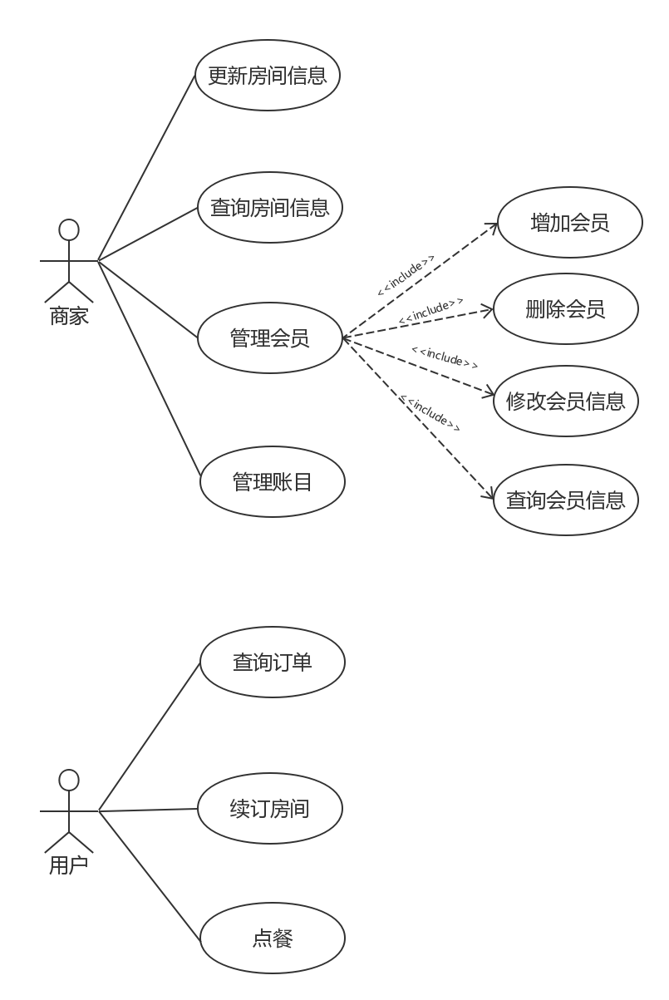

## 需求分析

### 问题陈述

#### 概述

**系统名称： KTV综合系统**

建立本系统的主要目的在于：

1. KTV商家可以快捷管理房间信息、会员信息
2. 会员可以快捷续订房间和点餐

#### 系统整体需求概述

用户角色划分：
    
系统需将用户分为管理员，会员。

#### 系统功能需求概述

本系统主要有以下2个功能模块构成，分别为：商家端和客户端

**商家端：**

1. 房间管理

房间管理系统包含查看所有房间、查找房间、新增房间、订房以及退房等功能。
    - 所有房间：管理员可以查看系统中所有房间，以及每一个房间的使用状态；
    - 查找房间：管理员可以输入特定的信息查找到满足条件的房间；
    - 新增房间：管理员可以向系统中添加房间；
    - 订房：管理员可以根据会员需求，使某个房间进入使用状态；
    - 退房：管理员可以使某个房间进入空闲状态。

2. 会员管理

会员管理包含查看所有会员、查找会员、新增会员、会员信息管理等功能。
    - 所有会员：管理员可以查看系统中所有会员，以及会员的个人信息；
    - 查找会员：管理员可以根据会员名字或者会员电话等信息查找会员；
    - 新增会员：管理员可以像系统中添加会员；
    - 会员信息管理：管理员可以修改会员的名字以及电话号码信息。

3. 账目管理

账目管理包含商品名字、商品信息和账目查询等功能。
    - 商品信息界面左边栏目为商品名字界面，该界面按类排列各种商品标签。点击任一商品的标签，则进入商品信息界面，该界面显示商品的价格和销售量状况，商家可通过其更改商品的名字和价格以及该商品的库存。
    - 账目查询界面，该界面面左边为所要查询账单的时间表，可筛选出要查询的账单的年月日信息。设定好所要查询的账单的时间信息后，右边栏目显示账单的具体财务信息，包括商品销售情况，且能将信息整合成可视化图表。

**客户端：**

**4）订单查询**
包括房间名字界面，订单信息界面和订单筛选界面。
房间名字界面左边栏目为房间名字界面，该界面按房间名排序。点击任一房间名标签，则进入订单信息界面。订单筛选界面按时间先后排序显示该房间在当日的所有时间段的订单标签，点击某一订单标签，则进入订单信息界面。订单信息界面显示该房间在这一时间段的所有消费记录，并将信息整合成可视化图表。
**5）消费模块**
消费模块包含代驾和点餐两项内容。
此模块的界面左边为点餐按钮，右边为代驾按钮，用户可以根据个人需要选择点餐服务和代驾服务。在用户选择完毕后，系统将该订单发送给商家端。在商家端处理完订单后，系统接收订单处理信息，提醒用户订单被接受或者被退回。
**6）编辑用户信息**
用户可以在编辑用户信息界面更改个人的用户信息（如账号、密码、电话号码）。

### 用例图

### 补充规约

#### 目标

本文档的目的是定义KTV综合系统的需求。本补充规约列出了不便于在用例模型的用例中获取的系统需求。补充规约和用例模型一起记录关于系统的一整套需求。

#### 范围

本补充规约使用于《KTV综合系统平台》，本补充规约补充了该系统的功能性需求和非功能性需求，如可靠性、可用性、性能和可支持性等。

#### 参考

无

#### 功能

多个用户必须能同时执行操作。如果某个用户所点服务无法完成，必须通知该用户。

#### 可行性

桌面用户界面应与Windows 10系统界面兼容。

#### 可靠性

系统提供任何能够正常连接互联网的设备的访问权限。尽量保证24小时均能访问。

#### 性能

系统能在1秒钟内做出反应，并且支持多人同时访问。必须能够在2分钟内处理所有订单的80%。

#### 可支持性

无。

#### 安全性

只有管理员能进入账目系统，发布、更新、删除商品。

#### 设计约束

使用MySQL数据库。

### 术语表

|术语|解释|
|---|---|
|KTV综合系统|一个用于KTV综合管理的系统，包括商家端和用户端|
|商家端|运行在KTV商家电脑上的KTV管理系统，包括房间管理、商品管理、会员信息管理等功能|
|房间信息|KTV房间的使用情况，包括房间号、房间类别、使用者、剩余消费时间等信息|
|商品信息|KTV中售卖的各种食物以及酒水饮料的信息，包括该物品的名称、价格、库存量等|
|会员信息|在KTV中办理会员的用户的相关信息，包括用户名、密码、手机号等|
|账目|KTV商家的账目记录，包括所有的消费记录、消费类别以及消费金额|
|用户端|运行在KTV点歌台上的KTV用户服务系统，包括点餐、代驾、呼叫服务员等功能|
|点餐|在KTV进行消费时，可以购买该KTV提供的各种食物以及酒水饮料|
|房间续订|增加房间的可消费时长，并支付相应的金额|
|管理员|一般为KTV前台服务员，负责房间管理和安排服务，并拥有管理注册用户信息权限|
|会员|在KTV进行消费，并且在KTV注册了会员的客人|
|用户名|注册会员时，需要用户输入唯一的用户名，用于确认会员身份|
